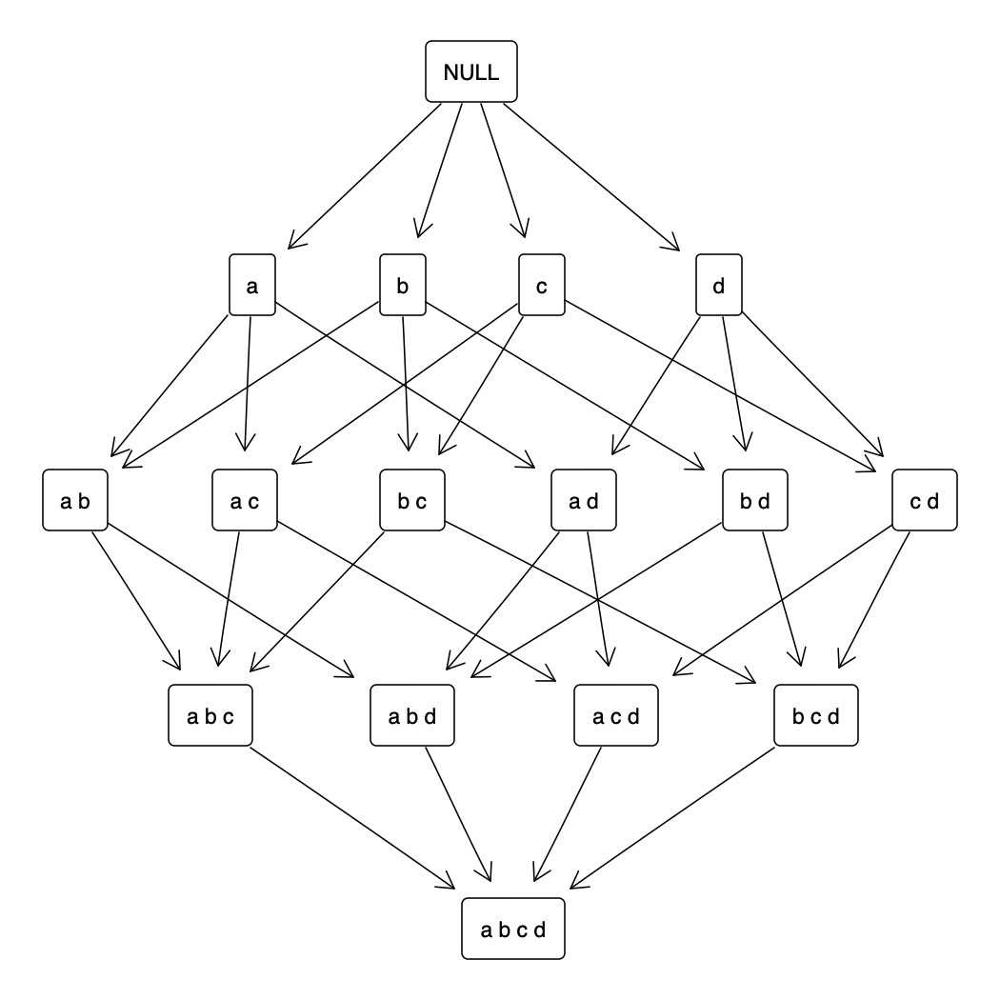
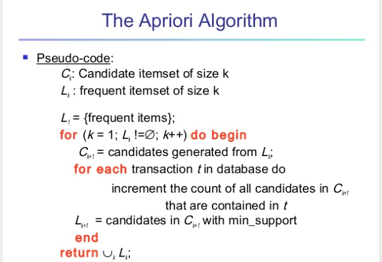
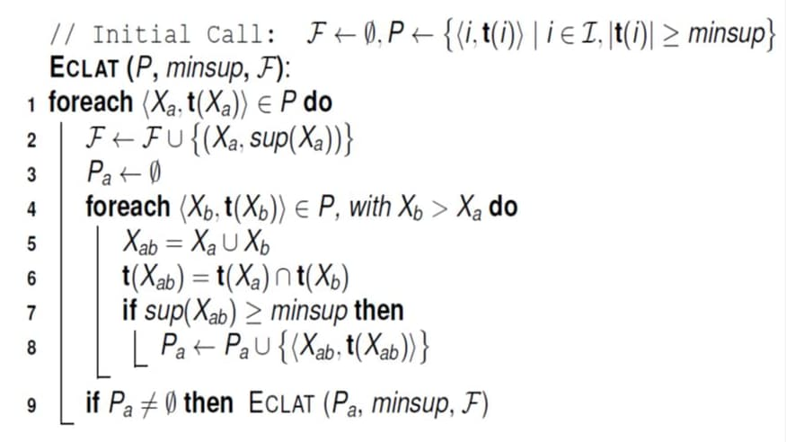

```{r setup, include=FALSE}
knitr::opts_chunk$set(echo = TRUE)
library(knitr)
library(tidyverse)
library(arulesViz)
```

## Overview

- Background
- Introduction
- Utility in OMOP CDM
- Available algorithms
- Computational time
- Further Work

## Background

Association rule mining (ARM) is a rule-based method for discovering interesting relations between variables in a database by using measures of interestingness. The concept was introduced by Rakesh Agrawal, Tomasz Imieliński and Arun Swam [1993], for discovering regularities between products in large-scale transaction data recorded by point-of-sale (POS) systems in supermarkets. ARM became the standard method in market-basket analysis. Some of the terminology we will be using is derived from this initial application of the concept. 

## Introduction

The problem as stated in Agrawal et al. (1993), was:

> "we are given a large database of customer transactions. Each transaction consists of items purchased by a customer in a visit. [...] Generate all significant association rules between items in the database that satisfy some user-defined  constraints"

The formal problem definition for market basket analysis was stated as follows: 

Let $I=\{i_{1},i_{2},...,i_{n}\}$ be a set of $n$ binary attributes called items.

Let $D=\{{t_{1},t_{2},... ,t_{m}}\}$ be a set of transactions called the database.

Each transaction in $D$ has a unique transaction ID and contains a subset of the items in $I$.

A rule is defined as an implication of the form $X\Rightarrow Y$, where $X,Y\subseteq I$ and $X \cap Y \neq \emptyset$.

In Agrawal, Imieliński, Swami[2] a rule is defined only between a set and a single item, ${X\Rightarrow i_{j}}$ for ${i_{j}\in I}$.

## Utility in OMOP CDM

In a structured database such as the CDM, association rules is an interesting candidate method for exploring interesting relationships between concepts. Adjusting the original problem definition to the OMOP CDM, it takes the following form:

Let $E=\{e_{1},e_{2},...,e_{n}\}$ be a set of $n$ binary attributes called events in a ***certain level of the hierarchy, in any domain of the CDM***.

Let $P=\{{p_{1},p_{2},... ,p_{m}}\}$ be a set of all patients in the CDM.

Each patient in $P$ has a unique patient ID and contains a subset of the events in $E$.

Define a rule of the form $X \Rightarrow Y :  X,Y\subseteq E$.

## Methods

### Data representation

```{r, echo=FALSE}
exampledf <- readRDS("plots/exampledf.Rds")
kable(exampledf[ c(1:9)])
```

### The search space

An easy way to visualize the space of possible combinations is to represent the itemsets in the form of a hasse diagram. 




### Measures of association

Interestingness measures are used to quantify the relations between items in a dataset. Let's have a look at some of them. 

a)    1.Support *(for one item/event)*: $$supp(e_{i}) = \frac{frequency (e_i)}{N} = P(e_i)$$
      2.Support *(between two events/sets)*: $$supp(X,Y) = P(X \cap Y) = P(X)P(Y|X)$$

b)    1.Confidence: $$conf(X, Y) = \frac {P(X \cap Y)}{P(X)}$$
      2.Expected confidence: $$E(conf(X, Y)) = P(X) \cdot P(Y)$$
      
c)    Lift: $$lift(X, Y) = \frac {conf(X, Y)}{E(conf(X, Y))} = \frac {P(X \cap Y)}{P(X) \cdot P(Y)} = \frac {P(Y|X)}{P(X)}$$

It is evident that these measures are simple boolean mathematical rules commonly widely used in mathematical algebra and logic. The list of available measures to date is much greater and we provide some of them below.

For more information visit [this site](https://michael.hahsler.net/research/association_rules/measures.html).

### Definitions

**Definition 1:** Consequent and Antecedent for a rule.

For a rule defined as $X \Rightarrow Y :  X,Y\subseteq E$, the LHS $X$ is called the *antecedent* and RHS $Y$ the *consequent*. 

**Definition:** Redundant rule.

A rule is redundant if a more general rules with the same or a higher confidence exists. That is, a more specific rule is redundant if it is only equally or even less predictive than a more general rule. A rule is more general if it has the same RHS but one or more items removed from the LHS. Formally, a rule X -> Y is redundant if for some $X' subset X, conf(X' -> Y) >= conf(X -> Y)$.
This is equivalent to a negative or zero improvement as defined by Bayardo et al. (2000). In this implementation other measures than confidence, e.g. improvement of lift, can be used as well.

**Definition:** Closed set.

The closure of an itemset is its largest proper superset which has the same support (is contained in exactly the same transactions). An itemset is closed, if it is its own closure (Pasquier et al. 1999).
It is a frequent itemset that is both closed and its support is greater than or equal to minsup.
An itemset is closed in a data set if there exists no superset that has the same support count as this original itemset. [source](http://www.hypertextbookshop.com/dataminingbook/public_version/contents/chapters/chapter002/section004/blue/page002.html])

**Definition:** Superset of a set or a rule.

**Definition:** Maximal set.

An itemset is maximal in a set if no proper superset of the itemset is contained in the set (Zaki et al., 1997). 
It is a frequent itemset for which none of its immediate supersets are frequent. 

**Definition:** Significant rule. Test of independence.

The implementation for association rules uses Fisher's exact test with correction for multiple comparisons to test the null hypothesis that the LHS and the RHS of the rule are independent. Significant rules have a p-value less then the specified significance level alpha (the null hypothesis of independence is rejected.).

### Algorithms

1. **Apriori**

Introduced by Agrawal and Srikant (1995), the **apriori** algorithm is one was designed to work on transactions to identify which items occur simultaneously most often. In this concept, each of the transactions considered is expected to be a set of items (itemset). To determine a relationship to be interesting, the algorithm defines a threshold T as the number of transactions in a database in which an itemset has to appear in order to be considered interesting e.g. support.  

Apriori uses an approach that begins by checking items of one element against the transactions in the database and then including further elements in the basket. If an itemset is found to be irrelevant with respect to the threshold T, the itemset is discarded to pass on to the next itemset in a breadth first search. At the end of the algorithm, the set of itemsets that pass the threshold T check are returned to the user. In order to further prune the returned itemset (since this may contain a large number of items if only T is defined) the user can also specify a support ε (support as defined in Section 1 above in this chapter) stating the percentage of transactions in which the itemset has to present itself in order to consider it a relevant association rule.  

Due to its simplicity, despite being historically relevant the Apriori algorithm has a number of limitations. The two most relevant limitations are that it generates a large number of subsets and that its breadth first traversing strategy takes a very long time to traverse the entire database. These limitations led researchers to look into more efficient algorithms for association rule mining, one of which is the FP-Growth algorithm introduced in the next section (also available in RapidMiner).

  

**Limitations**

Apriori, while historically significant, suffers from a number of inefficiencies or trade-offs, which have spawned other algorithms. Candidate generation generates large numbers of subsets (The algorithm attempts to load up the candidate set, with as many as possible subsets before each scan of the database). Bottom-up subset exploration (essentially a breadth-first traversal of the subset lattice) finds any maximal subset S only after all $2^{|S|}-1$ of its proper subsets.

The algorithm scans the database too many times, which reduces the overall performance. Due to this, the algorithm assumes that the database is Permanent in the memory.

Also, both the time and space complexity of this algorithm are very high: $O(2^{|D|})$, thus exponential, where $|D|$ is the horizontal width (the total number of items) present in the database.

Later algorithms such as Max-Miner[3] try to identify the maximal frequent item sets without enumerating their subsets, and perform "jumps" in the search space rather than a purely bottom-up approach.

2. **Eclat**

The Equivalence Class Clustering and bottom-up Lattice Traversal (ECLAT) algorithm is another method of Association Rule mining. It is a more efficient and scalable version of the Apriori algorithm. While the Apriori algorithm works in a horizontal sense imitating the Breadth-First Search of a graph, the ECLAT algorithm works in a vertical manner just like the Depth-First Search of a graph. This vertical approach of the ECLAT algorithm makes it a faster algorithm than the Apriori algorithm.

The basic idea of ECLAT is making use of all the sets intersections to compute the support value of a candidate and avoiding the generation of subsets which do not exist in the prefix tree. In the first call of the function, all single items are used along with their tidsets. Then the function is called recursively and in each recursive call, each item pair is verified and combined with other item pairs. This process is continued until no candidate item pairs can be combined.

  

3. **FP-Growth**

This algorithm is an improvement to the Apriori method. A frequent pattern is generated without the need for candidate generation. FP growth algorithm represents the database in the form of a tree called a frequent pattern tree or FP tree.

This tree structure will maintain the association between the itemsets. The database is fragmented using one frequent item. This fragmented part is called “pattern fragment”. The itemsets of these fragmented patterns are analyzed. Thus with this method, the search for frequent itemsets is reduced comparatively.

  

## Implementations

apriori: [package arules](https://www.rdocumentation.org/packages/arules/versions/1.6-6)

eclat: [package arules](https://www.rdocumentation.org/packages/arules/versions/1.6-6)

fpgrowth: [package rCBA](https://www.rdocumentation.org/packages/rCBA)


